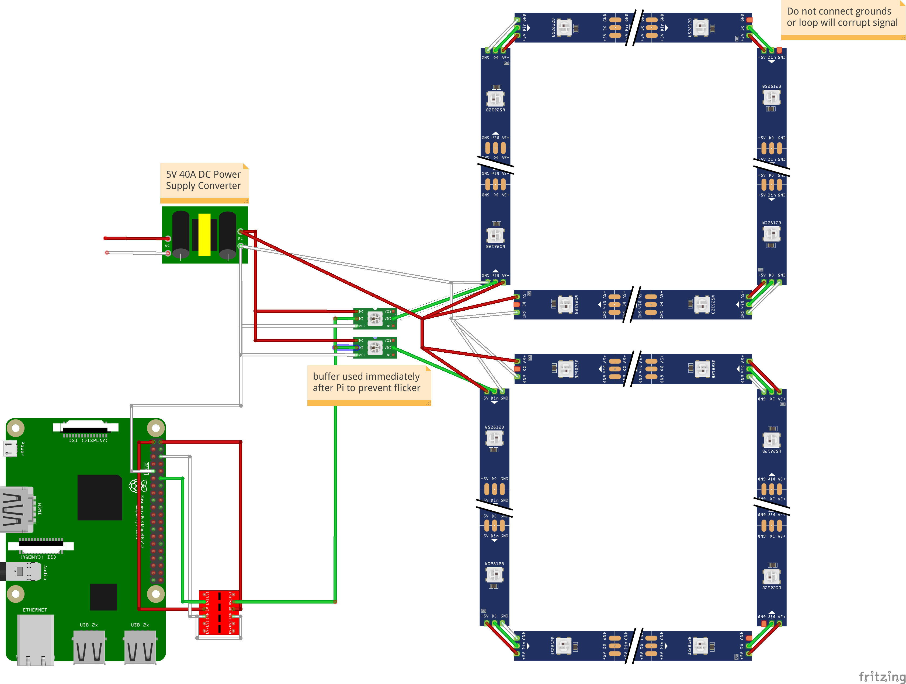

# Cello Performance Lighting
Since beginning cello lessons I've been amazed by both the beauty of the instrument and the patience required for daily monotonous practice sessions. This project serves to spice things up when it comes to playing basic scales by having an LED display that responds to the notes and tempo of what I play. Each note on the cello corresponds to a distinct color palette, and each string determines a different animation pattern.

## Using Application

### GUI Display

### LED Display

## Hardware Setup

